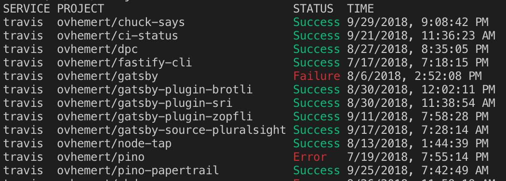

# CI-Status

[](https://travis-ci.com/ovhemert/ci-status)
[](https://ci.appveyor.com/project/ovhemert/ci-status)
[](https://www.codacy.com/app/ovhemert/ci-status?utm_source=github.com&amp;utm_medium=referral&amp;utm_content=ovhemert/ci-status&amp;utm_campaign=Badge_Grade)
[](https://snyk.io/test/npm/ci-status)
[](https://coveralls.io/github/ovhemert/ci-status?branch=master)
[](https://greenkeeper.io/)
[](http://standardjs.com/)

CI-Status displays the build status of projects on a continuous integration server in the console.
It's also possible to include the library into your own project.



## Requirements

A project that's building on a supported continuous integration server.
See the supported services list.

## Supported Services

This support list is a work-in-progress.

-   [x] Appveyor
-   [x] AWS CodePipeline
-   [ ] Buddybuild
-   [x] CircleCI
-   [ ] CruiseControl
-   [ ] GreenhouseCI
-   [ ] Hudson
-   [x] Jenkins
-   [ ] Semaphore
-   [ ] TeamCity
-   [x] Travis (travis-ci.com)

*Missing something? Suggest or contribute your own!*

## Installation

To use globally from command line:

```bash
$ npm install -g ci-status
```

To include as a library in your project:

```bash
$ npm install ci-status
```

## Usage

Example:

```bash
$ ci-status travis -o ovhemert
```

For a detailed description of all the commands and options available, see the [CLI](./docs/CLI.md) documentation.

## API

Want to use `ci-status` as a library in your project?
See the [API](./docs/API.md) documentation for details.

## Maintainers

Osmond van Hemert
[](https://github.com/ovhemert)
[](https://ovhemert.dev)

## Contributing

If you would like to help out with some code, check the [details](./docs/CONTRIBUTING.md).

Not a coder, but still want to support? Have a look at the options available to [donate](https://ovhemert.dev/donate).

## License

MIT
